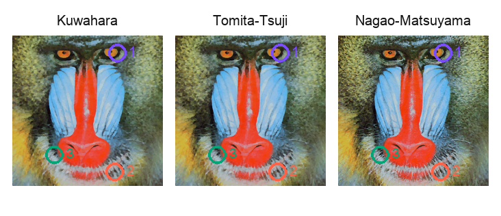
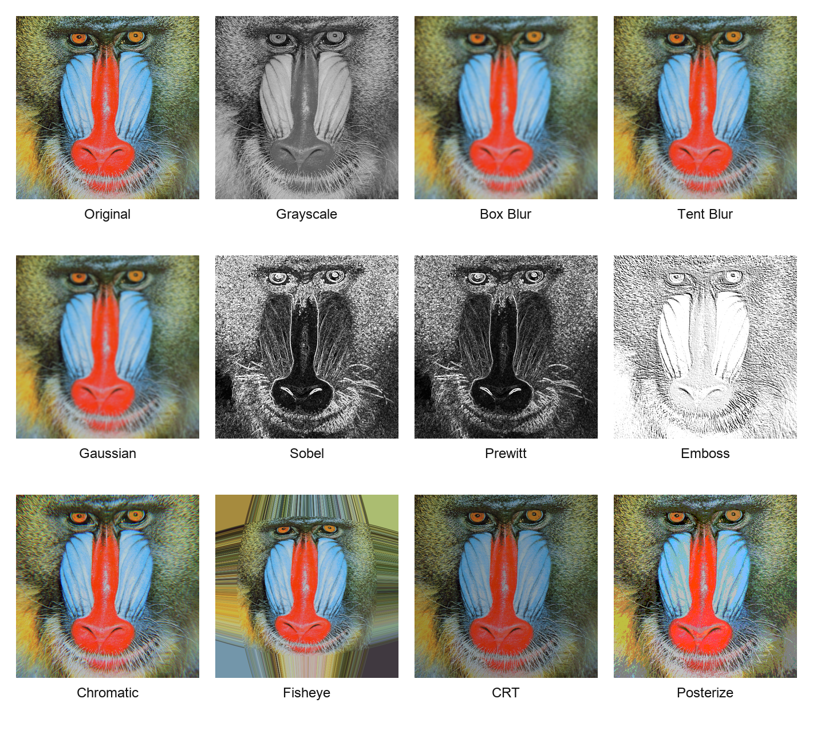
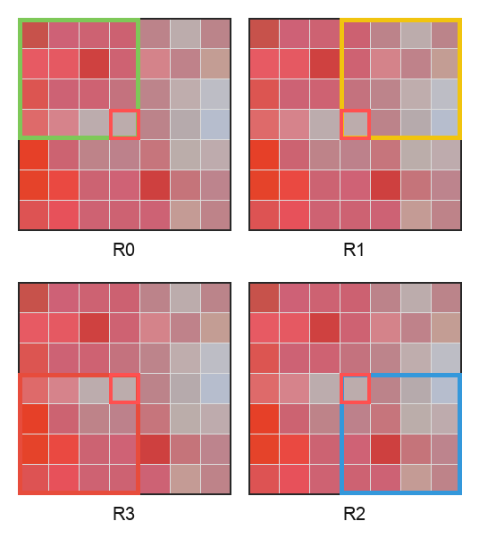
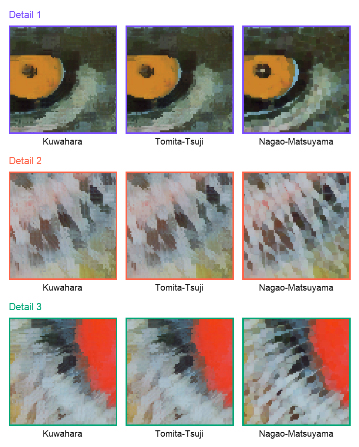

# Kuwahara Filter Playground

An interactive WebGL image-processing playground built for CSC 364, Davidson College's image processing course. The project demonstrates several classic spatial filters, with the main focus on Kuwahara-style edge-preserving smoothing:

- Original Kuwahara filter
- Tomita-Tsuji variant
- Nagao-Matsuyama variant

The app runs each filter as a GLSL fragment shader, so uploaded images, sample TIFFs, and live camera frames can be processed interactively in the browser.



## Features

- GPU-accelerated WebGL image filtering
- Drag-and-drop image upload
- Built-in sample images from common image-processing test sets
- TIFF support through UTIF
- Live camera input
- Split-view original vs. filtered comparison
- PNG export of the current filtered image
- Light and dark UI themes
- Poster figure generation for course presentation materials

## Running Locally

This repo uses Bun.

```bash
bun install
bun run dev
```

Then open the local URL printed by Vite, usually `http://localhost:5173/shader/`.

For a production build:

```bash
bun run build
bun run preview
```

## Project Structure

```text
.
├── index.html                  # App shell and controls
├── style.css                   # Responsive UI styling
├── src/
│   ├── app.js                  # UI, image loading, camera, compare mode
│   ├── filters.js              # Filter registry and slider metadata
│   └── webgl.js                # WebGL setup, shader compilation, uniforms
├── public/
│   ├── shaders/                # GLSL vertex and fragment shaders
│   └── test-images/            # Sample TIFF images
├── scripts/
│   ├── export-poster-assets.mjs # Browser screenshots and filter exports
│   └── build_poster_figures.py # Derived poster figures
└── poster-assets/              # Generated images used in the poster/README
```

## Implemented Filters

| Filter | Shader | Notes |
| --- | --- | --- |
| Passthrough | `public/shaders/passthrough.glsl` | Baseline identity shader |
| Grayscale | `public/shaders/grayscale.glsl` | Luminance conversion |
| Posterize | `public/shaders/posterize.glsl` | Quantizes each color channel |
| Box Blur | `public/shaders/box.glsl` | Uniform mean filter |
| Tent Blur | `public/shaders/tent.glsl` | Weighted triangular blur |
| Gaussian Blur | `public/shaders/gaussian.glsl` | Distance-weighted blur using sigma |
| Sobel Edge | `public/shaders/sobel.glsl` | 3x3 Sobel gradient magnitude |
| Prewitt Edge | `public/shaders/prewitt.glsl` | 3x3 Prewitt gradient magnitude |
| Emboss | `public/shaders/emboss.glsl` | Directional relief kernel |
| Chromatic Aberration | `public/shaders/chromatic.glsl` | Radial RGB channel offsets |
| CRT | `public/shaders/crt.glsl` | Scanline simulation |
| Fisheye | `public/shaders/fisheye.glsl` | Radial barrel distortion |
| Kuwahara | `public/shaders/kuwahara.glsl` | Four-region variance-minimizing smoother |
| Tomita-Tsuji | `public/shaders/tomita.glsl` | Kuwahara variant with an added centered region |
| Nagao-Matsuyama | `public/shaders/nagao.glsl` | Nine-region edge-preserving smoother |



## Kuwahara Filter

The Kuwahara filter is an edge-preserving smoothing filter. For each output pixel, it looks at multiple overlapping neighborhoods around the source pixel. Each neighborhood gets two statistics:

- the mean color
- the total color variance

The output pixel becomes the mean color from the neighborhood with the lowest variance. Smooth regions tend to have low variance, so they are averaged aggressively. Edges tend to create high variance in neighborhoods that cross them, so the filter chooses a region mostly on one side of the edge.

In `public/shaders/kuwahara.glsl`, each pixel is divided into four quadrant-like regions around the center pixel. With radius `r`, each region samples `(r + 1) x (r + 1)` pixels. The shader computes:

```glsl
mean = S1 / n
variance = S2 / n - mean * mean
totalVariance = variance.r + variance.g + variance.b
```

The color from the minimum-variance region becomes `gl_FragColor`.



## Kuwahara Variants

Tomita-Tsuji extends the four Kuwahara quadrants with a fifth centered square region. This gives the filter another candidate when the most stable local area is centered around the current pixel instead of falling cleanly into one quadrant.

Nagao-Matsuyama uses nine candidate regions over a local pattern. In this implementation, the slider controls the sampling scale, so increasing the radius broadens the region search while keeping the GPU loop bounds fixed for WebGL compatibility.



## Adding a Filter

1. Add a fragment shader to `public/shaders/`.
2. Add an entry to `FILTERS` in `src/filters.js`.
3. Define any slider-controlled uniforms in that entry.

The app provides these common values to shaders that declare them:

```glsl
uniform sampler2D uTexture;
uniform vec2 uResolution;
varying vec2 vTexCoord;
```

Only declare `uResolution` in the shader when it is actually used.

## Poster Assets

The generated figures in `poster-assets/` are intentionally checked in because they are part of the CSC 364 presentation material and are referenced by this README.

To regenerate them:

```bash
bun run poster-assets
```

The browser export step uses Playwright and Vite. The Python figure-building step requires `numpy` and `Pillow`:

```bash
python3 -m pip install numpy pillow
```

## Deployment Notes

`vite.config.js` sets `base: '/shader/'`, which is useful when deploying the app under a `/shader/` subpath, such as GitHub Pages. If deploying at a domain root, change the Vite base to `'/'`.

Camera input requires a secure context in most browsers. It works on `localhost` during development and on HTTPS deployments.

## Limitations

- The shader loops use fixed maximum bounds because WebGL 1 requires compile-time loop limits on many devices.
- Large uploaded images are downscaled to a maximum dimension of 1200 pixels before upload.
- The Kuwahara-family filters are educational implementations, optimized for clarity and interactivity rather than maximum GPU performance.
